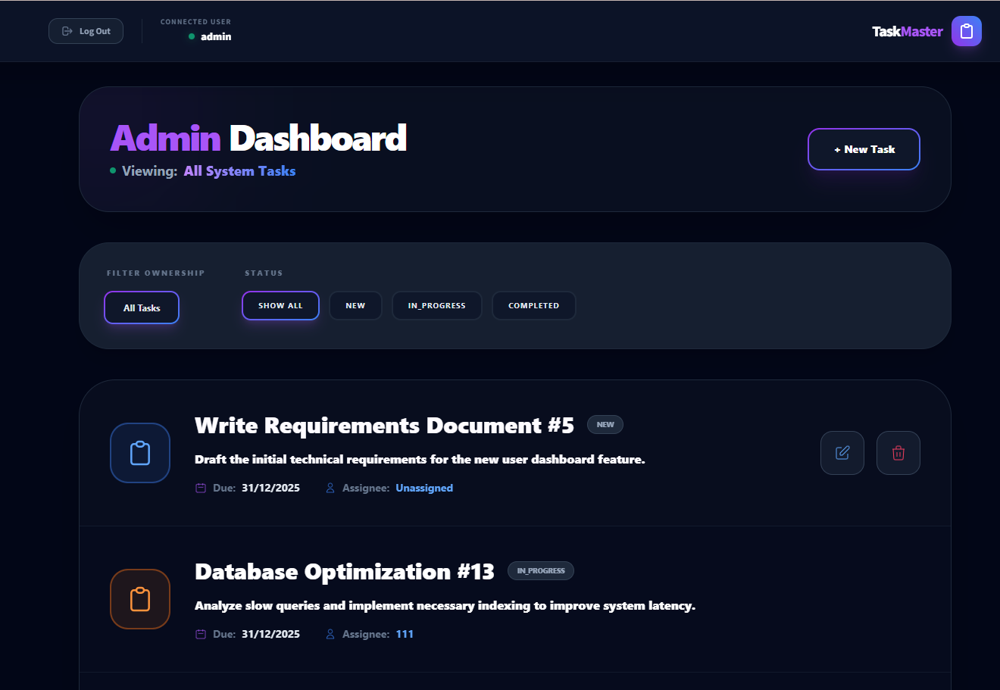
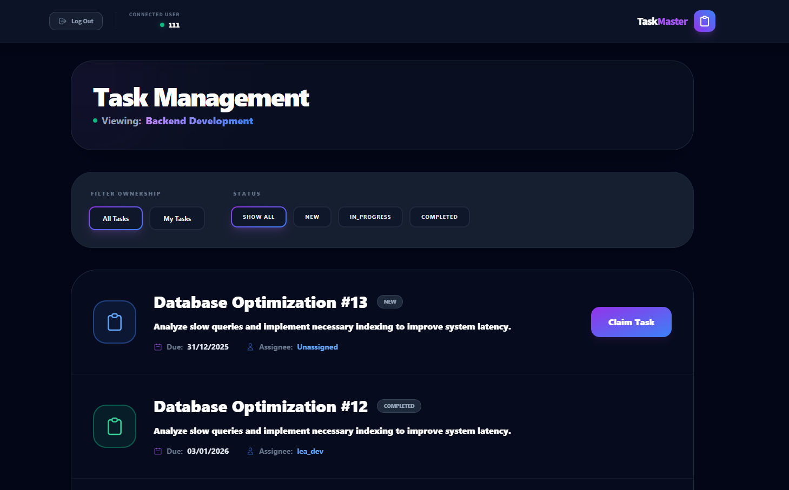
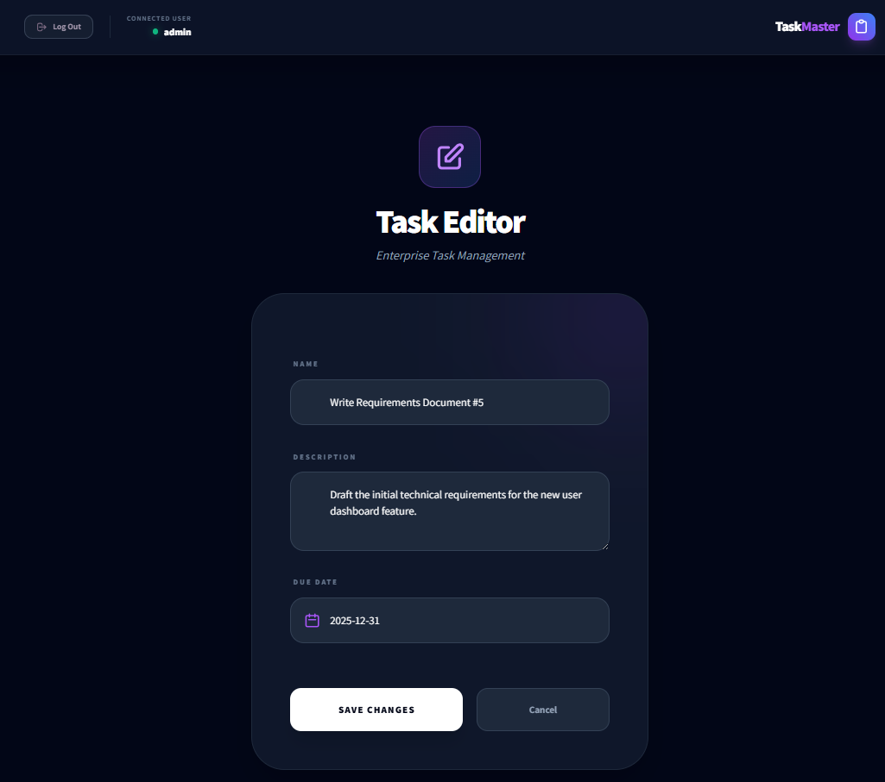
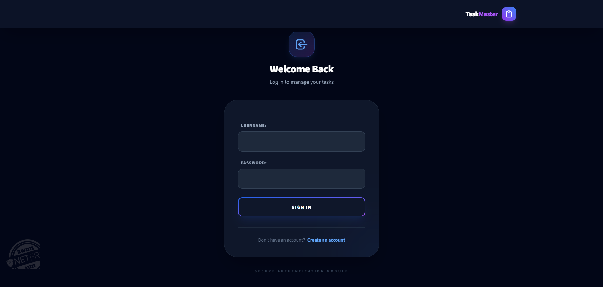
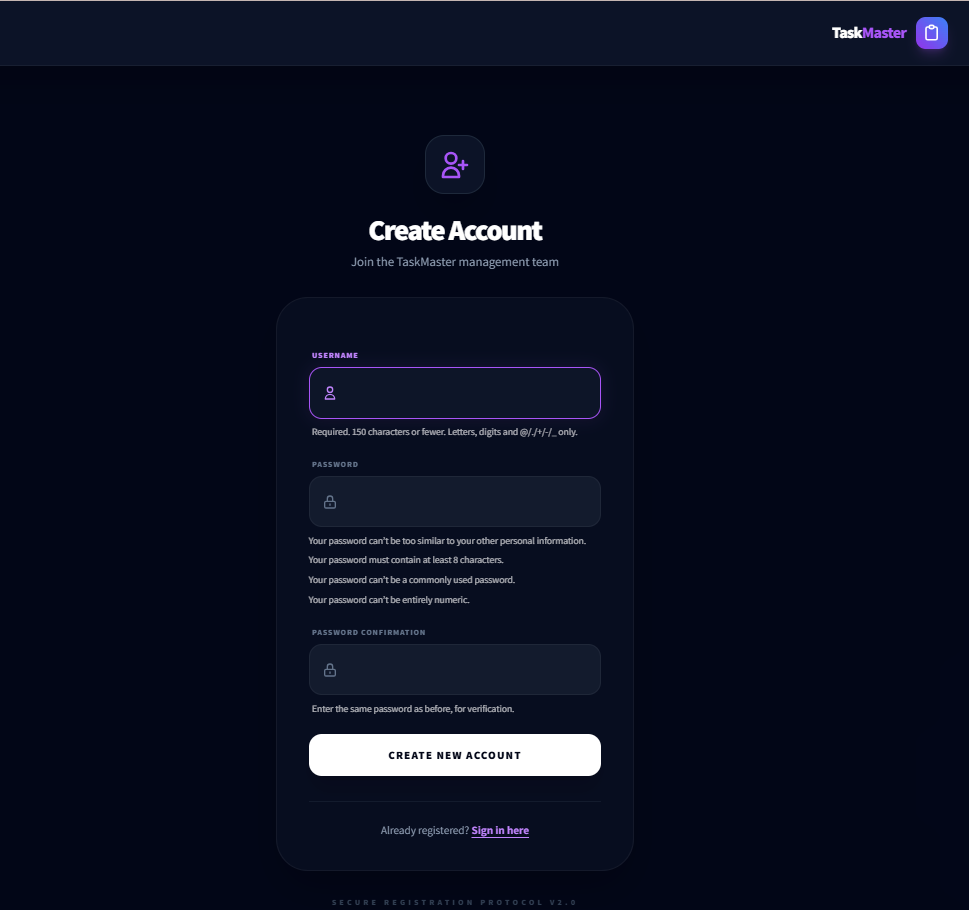
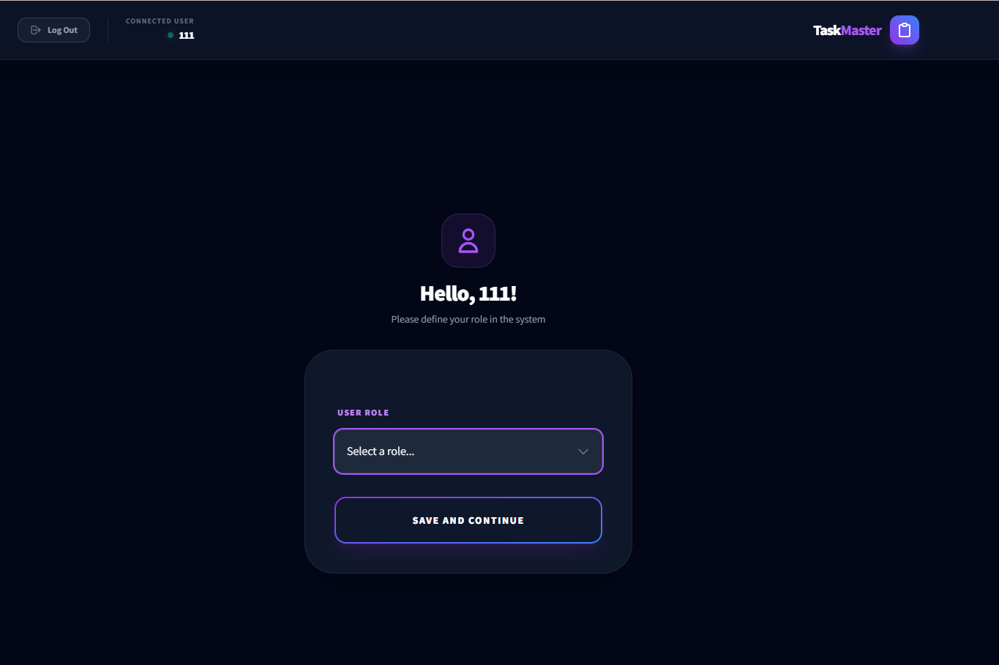

# 🚀 TaskMaster - Enterprise Task Management System

TaskMaster is a high-performance, dark-themed task management platform. Built with **Django** and **Tailwind CSS**, it offers a premium user experience for managing team workflows, tracking deadlines, and organizing enterprise-level projects.

## ✨ Key Features
* **Premium Dark UI**: A sleek Glassmorphism design featuring translucent cards and vibrant glow effects.
* **Role-Based Dashboards**: Specialized views for **Admins** (full control) and **Employees** (personal task management).
* **Advanced Filtering**: Real-time filtering by ownership (All/My Tasks) and status (New, In Progress, Completed).
* **Custom Seed System**: A built-in management command to populate the database with realistic sample data for testing.
* **Secure Authentication**: Custom-styled registration and login flows with field-level validation.

## 📸 System Overview

### 🖥️ Management Dashboard

*View and manage all system tasks with full administrative privileges.*

### 📊 Task List & Interaction
| Task Overview | Task Editor |
| :---: | :---: |
|  |  |
*Interactive task board with status badges and intuitive action buttons.*

### 🔐 Authentication & Profile Setup
| Welcome Back | Create Account | Profile Configuration |
| :---: | :---: | :---: |
|  |  |  |
*Seamless onboarding experience with role-based profile initialization.*

## 🛠️ Tech Stack
* **Backend**: Python 3.12 / Django 6.0
* **Frontend**: Tailwind CSS (Premium Dark Theme)
* **Interactive UI**: Flatpickr (Date Management), Lucide Icons
* **Database**: SQLite (Development)

## 📂 Project Structure
As shown in the project tree:
* `TaskManagementApp/management/commands/seed_data.py`: Custom script for DB population.
* `staticPhoto/`: Repository for all system screenshots and assets.
* `Templates/`: Custom-designed HTML templates with embedded Tailwind styling.

## 🚀 Quick Start
1.  **Clone & Install**:
    ```bash
    git clone [https://github.com/yourusername/TaskManagement.git](https://github.com/yourusername/TaskManagement.git)
    pip install -r requirements.txt
    ```
2.  **Initialize Database**:
    ```bash
    python manage.py migrate
    ```
3.  **Seed Sample Data**:
    ```bash
    python manage.py seed_data
    ```
4.  **Launch**:
    ```bash
    python manage.py runserver
    ```
